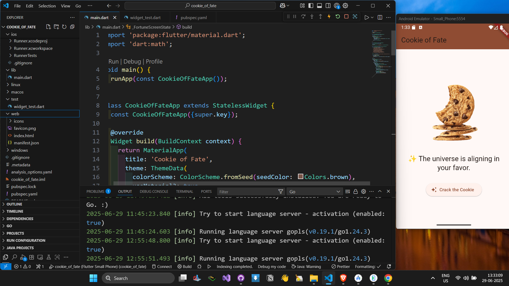
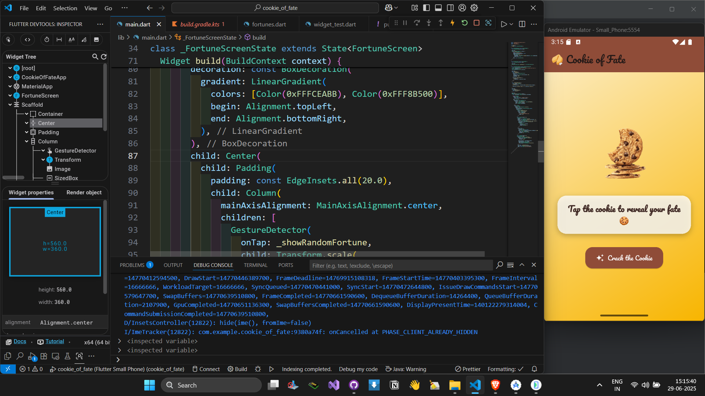
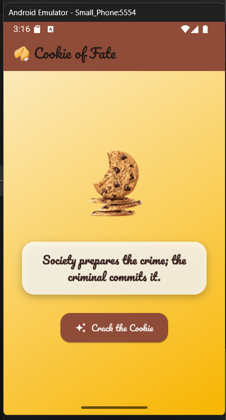

# 🍪 Cookie of Fate

A delightful Flutter app that reveals a random fortune each time you crack open the magical cookie! Built as part of the *Getting Started with Flutter & Dart* course on Coursera (Packt x Coursera), this app demonstrates core Flutter concepts like widgets, state management, image assets, UI styling, and modular code organization.

---

## ✨ Features

- 🎯 Tap the cookie to reveal a random fortune
- 🧠 Over 60+ motivational, fun, and quirky fortune messages
- 🖼️ Clean and responsive UI with a cookie-themed aesthetic
- 🧩 Modular architecture (fortunes separated into a Dart file)
- ⚡ Uses `setState` for dynamic UI updates
- 🧪 Widget-tested for correctness with `flutter_test`
- 🧩 Material 3 design with theme customization
- 🐛 Hot reload supported for faster development

---

## 🛠️ How It's Made

- **Framework**: [Flutter](https://flutter.dev/)
- **Language**: Dart
- **State Management**: `setState`
- **UI Components**: `MaterialApp`, `Scaffold`, `AppBar`, `ElevatedButton`, `Image.asset`, `Text`
- **Randomization**: Dart's `Random` class
- **Testing**: Basic widget test to ensure fortune changes on tap
- **Modular Code**:
  - `main.dart`: App setup and UI logic
  - `fortunes.dart`: Stores the list of fortune messages

---
## 🔮 Preview

Explore how the **Cookie of Fate** app looks and works:

### 📱 Screenshots

| Welcome Screen v1            | Fortune Revealed v2              |
|-----------------------------|----------------------------------|
|  |  |

Additional UI variation:

| Clean Fortune Layout v2     |
|----------------------------|
|  

---

### 🎥 Live Demo

Watch the app in action:

[▶️ Watch Demo](https://github.com/MrRogueKnight/Cookie-of-Fate/raw/rogue/Running%20cookie_of_fate.mp4)


> 💡 *The video is stored directly in the repository and can be downloaded or previewed.*

---

## 📂 Project Structure

```

cookie\_of\_fate/
├── assets/
│   └── images/
│       └── cookies.png
├── lib/
│   ├── fortunes.dart
│   └── main.dart
├── test/
│   └── widget\_test.dart
├── pubspec.yaml
└── README.md

````

---

## 🚀 Getting Started

### Prerequisites

- Flutter SDK (v3.8+ recommended)
- VS Code or Android Studio
- A physical device or emulator

### Run Locally

```bash
git clone https://github.com/MrRogueKnight/Cookie-of-Fate.git
cd Cookie-of-Fate
flutter pub get
flutter run
````

> 💡 Make sure to connect a device or launch an emulator before running.

---

## 🧪 Testing

```bash
flutter test
```

This runs a widget test that ensures the fortune message changes on button press.

---

## 💡 Possible Enhancements

* Add sound effects or animations
* Support dark mode and multiple themes
* Use a package like `provider` or `riverpod` for better state management
* Add user interaction history or "favorite fortunes"

---

## 📚 Credits

* Developed by [@MrRogueKnight](https://github.com/MrRogueKnight)
* Based on Coursera Module: *Getting Started with Flutter & Dart* by Packt

---

## 📄 License

This project is open source and available under the [MIT License](LICENSE).

---

🌟 **Star** this repo if you liked it — it helps others discover it too!


# TipCalcPro 💰

[](https://flutter.dev)
[](https://opensource.org/licenses/MIT)

A beautiful and intuitive tip calculator with bill splitting functionality, built with Flutter.

## Features ✨

- 💵 Calculate tips and split bills with ease
- 🌗 Dark/Light mode toggle
- 📊 Multiple tip percentage presets (10%, 15%, 18%, 20%, 25%)
- 👥 Split bills between any number of people
- 📅 History of previous calculations
- 📱 Responsive design for all screen sizes
- 🎨 Material 3 design with dynamic theming

## Installation 🛠️

### Prerequisites
- Flutter SDK (version 3.13.0 or higher)
- Dart SDK (version 3.1.0 or higher)

### Steps
1. Clone the repository:
   ```bash
   git clone https://github.com/MrRogueKnight/TipCalcPro.git
   cd TipCalcPro
   ```

2. Install dependencies:
   ```bash
   flutter pub get
   ```

3. Run the app:
   ```bash
   flutter run
   ```

## Building for Production 🚀

### Android
```bash
flutter build apk --release
```

### iOS
```bash
flutter build ios --release
```

### Windows
```bash
flutter build windows --release
```

## Packages Used 📦
- `shared_preferences`: For storing theme preferences
- `intl`: For date formatting
- `flutter/services`: For haptic feedback

## Project Structure 📂
```
lib/
├── main.dart            # Main application entry point
├── widgets/
│   ├── amount_card.dart # Total amount display card
│   ├── bill_input.dart  # Bill amount input field
│   ├── tip_presets.dart # Tip percentage selector
│   ├── split_controls.dart # Bill split controls
│   └── history_list.dart # Calculation history
```

## Contributing 🤝
Contributions are welcome! Please follow these steps:
1. Fork the project
2. Create your feature branch (`git checkout -b feature/AmazingFeature`)
3. Commit your changes (`git commit -m 'Add some AmazingFeature'`)
4. Push to the branch (`git push origin feature/AmazingFeature`)
5. Open a Pull Request

## License 📄
This project is licensed under the MIT License - see the [LICENSE](LICENSE) file for details.

